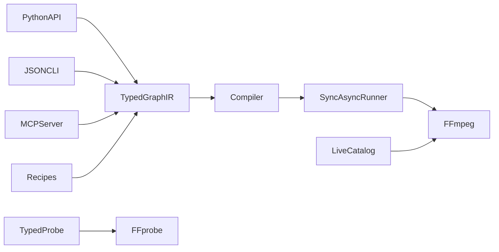

# ffmpeg-zeo

[](https://pypi.org/project/ffmpeg-zeo/)
[](https://pypi.org/project/ffmpeg-zeo/)
[](LICENSE)

Typed FFmpeg filter graphs for Python applications, command-line automation,
and coding agents.

`ffmpeg-zeo` gives the same media job one portable representation: build a
graph with a fluent Python API or a Pydantic model, inspect the generated
command, serialize it as JSON, and run it through Python, the CLI, or MCP. It
is inspired by
[ffmpeg-python](https://github.com/kkroening/ffmpeg-python)'s graph compiler
and [pyffmpeg](https://github.com/deuteronomy-works/pyffmpeg)'s approachable
setup, but is a new library rather than a drop-in fork.

## Why ffmpeg-zeo?

- Typed, validated graph IR built on Pydantic
- Fluent graphs with stream selectors, fan-out, multi-input filters, and
  automatic `split` / `asplit` insertion
- Synchronous and asynchronous execution
- Typed `ffprobe` results with useful media properties
- Reusable recipes for common conversions
- JSON-first CLI designed for scripts and agents
- Optional stdio MCP server for Cursor and Claude Code
- Live filter and codec discovery from the FFmpeg installed on your machine
- No FFmpeg binary bundled in the Python wheel

## Requirements

- Python 3.12 or newer
- `ffmpeg` and `ffprobe`

Binary discovery checks `FFMPEG_BINARY` / `FFPROBE_BINARY`, then `PATH`, then
the ffmpeg-zeo cache. Linux x86_64/aarch64 and Windows x86_64 users can
explicitly download BtbN LGPL essentials builds:

```bash
ffmpeg-zeo doctor --download
```

macOS users should install FFmpeg through a system package manager, for
example `brew install ffmpeg`; automatic download is not available on macOS.
Run `ffmpeg-zeo doctor` to verify the active binaries.

## Installation

```bash
uv add ffmpeg-zeo
# or
python -m pip install ffmpeg-zeo
```

Install the optional MCP server with:

```bash
uv add "ffmpeg-zeo[mcp]"
# or
python -m pip install "ffmpeg-zeo[mcp]"
```

The Python import is always:

```python
import ffmpeg_zeo
```

## Quick start

Probe first, use a recipe when one fits, and compile custom graphs before
running them:

```python
import ffmpeg_zeo

info = ffmpeg_zeo.probe("input.mp4")
print(info.duration_seconds, info.width, info.height, info.video_codec)

graph = ffmpeg_zeo.convert("input.mp4", "output.mp3")
print(ffmpeg_zeo.compile_graph(graph))

result = ffmpeg_zeo.run(graph)
print(result.returncode)
```

## Fluent Python graphs

Build a custom graph and inspect the exact argv before execution:

```python
from ffmpeg_zeo import input

job = (
    input("input.mp4")
    .video
    .filter("scale", 1280, -2)
    .output("output.mp4", vcodec="libx264", crf=23, an=None)
    .overwrite("always")
)

print(job.compile())
result = job.run(capture_stderr=True)
```

Stream selectors use `.video`, `.audio`, `["v"]`, or `["a"]`. Multi-input
filters merge their input graphs:

```python
from ffmpeg_zeo import input

background = input("background.mp4").video
logo = input("logo.png").video.filter("scale", 160, -1)

(
    background
    .overlay(logo, x="W-w-24", y="H-h-24")
    .output("branded.mp4", vcodec="libx264")
    .overwrite("always")
    .run()
)
```

When one stream feeds multiple downstream nodes, the compiler inserts the
required `split` or `asplit` filter automatically.

### Async execution and progress

```python
import asyncio
from ffmpeg_zeo import input

async def main() -> None:
    job = (
        input("input.mp4")
        .filter("scale", 1280, -2)
        .output("output.mp4")
        .overwrite("always")
    )
    result = await job.run_async(capture_stderr=True)
    print(result.returncode)

asyncio.run(main())
```

For progress callbacks, pass `on_progress=` to `ffmpeg_zeo.run()` or
`ffmpeg_zeo.run_async()`. A `Progress` event exposes `frame`, `fps`,
`out_time_seconds`, `total_size`, and `speed`.

Failures raise `FFmpegError`, which includes the argv, return code, stdout,
and stderr. Missing executables raise `BinaryNotFoundError`.

## Recipes

Recipes return a `Graph`; they do not hide compilation or execution.

- `convert(src, dst, overwrite="always")`
- `thumbnail(src, dst, time=1.0)`
- `transcode_h264(src, dst, crf=23, preset="medium")`
- `extract_audio(src, dst, codec="copy")`
- `extract_cover(src, dst)`
- `scale(src, dst, width=1280, height=-2)`
- `clip(src, dst, start, end=None)`
- `burn_subtitles(src, dst, subtitles)`
- `concat_demuxer(paths, dst)`

```python
from ffmpeg_zeo import run
from ffmpeg_zeo.recipes import thumbnail, transcode_h264

run(thumbnail("input.mp4", "cover.jpg", time=5.0))
run(transcode_h264("input.mov", "output.mp4", crf=20, preset="slow"))
```

Discover recipe names with `ffmpeg-zeo catalog recipes`.

## Graph JSON

Every graph is a Pydantic model and can round-trip through JSON:

```python
from ffmpeg_zeo import Graph, input

graph = (
    input("input.mp4")
    .filter("scale", 1280, -2)
    .output("output.mp4", vcodec="libx264")
    .overwrite("always")
    .build()
)

payload = graph.model_dump_json(indent=2)
restored = Graph.model_validate_json(payload)
```

The same document can be compiled without executing it:

```bash
ffmpeg-zeo compile graph.json
ffmpeg-zeo run graph.json --json
cat graph.json | ffmpeg-zeo compile -
```

A graph contains `inputs`, `filters`, `outputs`, `global_args`, and an
optional overwrite policy (`always` or `never`). This stable JSON boundary is
useful for reviewing agent-generated jobs before allowing execution.

## CLI

The CLI emits structured JSON for automation:

```bash
ffmpeg-zeo doctor
ffmpeg-zeo probe input.mp4 --json
ffmpeg-zeo convert input.mp4 output.mp3 --overwrite always
ffmpeg-zeo compile graph.json
ffmpeg-zeo run graph.json --json
ffmpeg-zeo recipe thumbnail --params src=input.mp4 --params dst=cover.jpg
ffmpeg-zeo catalog filters
ffmpeg-zeo catalog codecs
ffmpeg-zeo catalog recipes
ffmpeg-zeo filter-help scale
ffmpeg-zeo version
```

Use `ffmpeg-zeo COMMAND --help` for complete command options. `compile` and
`run` accept `-` to read a graph from stdin.

## MCP and coding agents

After installing the `mcp` extra, start the stdio server with:

```bash
ffmpeg-zeo-mcp
```

Example MCP configuration:

```json
{
  "mcpServers": {
    "ffmpeg-zeo": {
      "command": "ffmpeg-zeo-mcp"
    }
  }
}
```

The server exposes tools to check binaries, probe files, compile and run Graph
JSON, convert files, discover filters and codecs, inspect filter help, and
list or run named recipes. It logs only to stderr so stdout remains a valid
stdio protocol stream.

Repository integrations are available in:

- Cursor skill: [`.cursor/skills/ffmpeg-zeo/`](.cursor/skills/ffmpeg-zeo/)
- Cursor MCP example: [`.cursor/mcp.json.example`](.cursor/mcp.json.example)
- Claude Code plugin: [`plugin/ffmpeg-zeo/`](plugin/ffmpeg-zeo/)

## Best practices

1. Run `ffmpeg-zeo doctor` before processing media in a new environment.
2. Probe input files; do not assume duration, dimensions, codecs, or streams.
3. Prefer a named recipe for common jobs.
4. For a custom graph, inspect `compile()` or use the CLI `compile` command
   before execution.
5. Discover available filters with `catalog filters` and inspect parameters
   with `filter-help`; FFmpeg builds differ.
6. Set overwrite behavior explicitly to `always` or `never`. ffmpeg-zeo never
   opens an interactive overwrite prompt.
7. Treat paths and filter expressions from untrusted users as untrusted input.

## Architecture



The graph IR is the shared boundary. The compiler performs graph ordering,
labeling, stream selection, escaping, and fan-out insertion; the runner owns
process execution and typed failures.

## Development

```bash
git clone https://github.com/zeroemployeeorg/ffmpeg-zeo.git
cd ffmpeg-zeo
uv sync --extra dev --extra mcp
make check
uv build
```

See [CONTRIBUTING.md](CONTRIBUTING.md) for the complete contributor workflow
and [CHANGELOG.md](CHANGELOG.md) for release history.

## Support and security

Use [GitHub Issues](https://github.com/zeroemployeeorg/ffmpeg-zeo/issues) for
reproducible bugs and feature requests. Include the output of
`ffmpeg-zeo version`, the compiled argv, operating system, and FFmpeg build
when reporting media-specific failures. Do not include private media or
credentials.

## License

ffmpeg-zeo is licensed under Apache-2.0. FFmpeg and ffprobe are separate
programs with their own licenses; downloaded BtbN LGPL builds are not part of
the Python distribution. Review [LICENSE](LICENSE) and [NOTICE](NOTICE).
